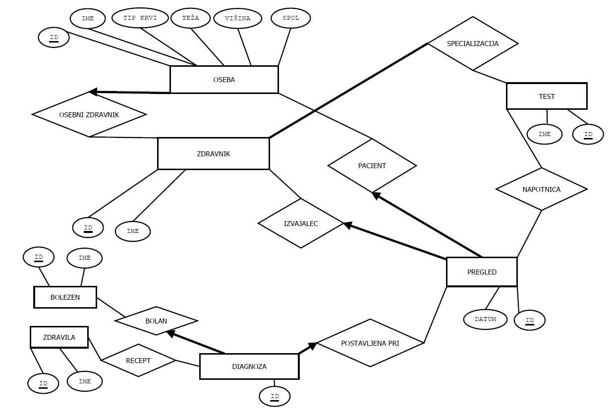

# e-kartoteka
Repozitorij za projekt pri predmetu osnove podatkovnih baz, na katerem delamo: Leon Horvat, Metod Jazbec in Jernej Banevec.

Poskusili bomo implementirati medicinsko bazo, v katero se bodo beležili vsi opravljeni pregledi. 
Rezultat pregleda je lahko ali napotitev na dodatni test (napotnica) ali postavljena diagnoza. 
Za izdelavo uporabniškega vmesnika bomo uporabili bottle ali Django (oba Python frameworka).

TODO: optimalno modeliranje tabele pregled (primerne podatkovne strukture), relacija s tabelo diagnoza, dodati manjkajoče atribute

PRIMER: https://dba.stackexchange.com/questions/157148/how-can-i-model-a-medical-scenario-in-an-entity-relationship-diagram

